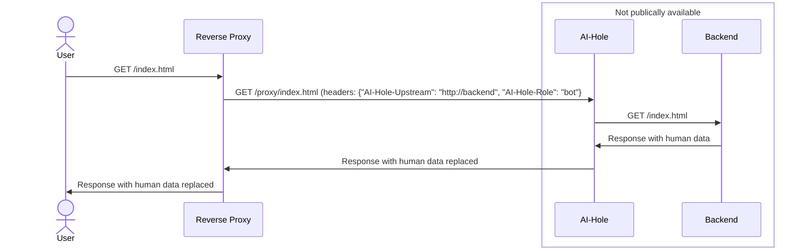

# AI-Hole
Don't just block AI bots - fill up their datasets with garbage!  
Thank you [u/emma](https://raddle.me/u/emma) for the idea.  

## Concepts
### Modes
AI-Hole supports two modes, and it is very important not to mix them, or you might end up with some weird HTML.

#### Legacy mode
In legacy mode, you specify CSS selectors in `config.yaml`.
All elements which match the selector will be randomized/removed

#### Attribute mode (recommended)
In tag mode, you add attributes to each element to randomize/remove it.  
The attributes will be removed once it hits ai-hole.  
```html
<p ai-hole-bot="randomize">This will be changed to random words</p>
<p ai-hole-bot="remove">This tag will be removed</p>
```
You can also specify the amount of words that it will be replaced by with the `ai-hole-randomize-word-count` attribute (and the default can be configured in `config.yaml`)

##### Example config
```yaml
default_random_words_count: 10
selectors:
  html:
    randomized:
      - p
      - a
      - li
      - title
    removed:
      - h1
      - h2
```

### Actions
#### Randomize
This will replace the innerText of the object with random words
#### Remove
This will remove the element from the DOM

## Recommended setup

It is recommended to use a reverse proxy in front of aihole to:
1. Identify malicious bots. AI-Hole will process your responses and redact human generated content, but will not detect bots for you.
2. Load balancing

## Example HAProxy setup
```haproxy
backend aihole
    balance roundrobin
    mode http
    server aihole1 http://aihole:8000 check

frontend http
    bind *:80
    mode http
    
    # When we should feed the user 
    acl is_bot req.hdr(Host) -i GPTBot
    
    # The actual URL to route to
    http-request set-header AI-Hole-Upstream http://backend # At the moment you would need this to point to a load balancer to load balance. Sorry!

    http-request set-header AI-Hole-Role bot if is_bot
    http-request set-header AI-Hole-Role human unless is_bot
    
    http-request set-path /proxy/%[path]
    default_backend aihole
```

This assumes that you have modified `/etc/hosts` or use docker or similar to get `aihole` and `backend` registered in DNS.

## Prometheus
A `/metrics` endpoint is available, however it is currently untyped and undocumented.

## Common foot-guns
### Mixing legacy and attribute mode
When attribute and legacy mode is mixed, it might result in two actions being chosen for the same element. This causes absolute chaos.  
  
When randomize and remove is mixed, the randomized content gets placed outside the tag.

## Passing large files uploads/downloads via AI-Hole
AI-Hole reads the entire request, then once its done with that it does a request to the backend, and downloads the entire response before responding with it.  
This might add significant slowdowns when downloading large files, and cause tons of memory to be wasted. Ideally you would pass these directly to the backend.

## Sending unsupported media types
Currently, only the `text/html` response minetype will be processed.  
Anything else will be passed through exactly like the original, however much less efficient than passing it directly.
